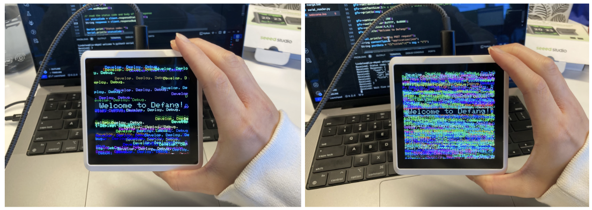
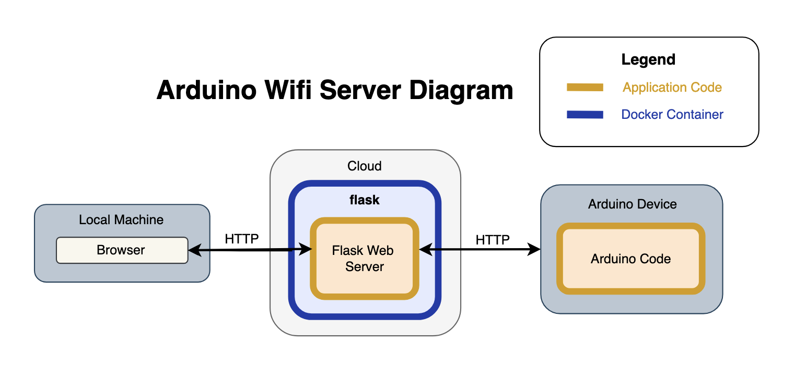

# Arduino Flask Wifi Server

[](https://portal.defang.dev/redirect?url=https%3A%2F%2Fgithub.com%2Fnew%3Ftemplate_name%3Dsample-<arduino-wifi-template%26template_owner%3DDefangSamples)



This sample contains an interactive wifi-connected UI program for a [SenseCAP Indicator Device](https://wiki.seeedstudio.com/Sensor/SenseCAP/SenseCAP_Indicator/Get_started_with_SenseCAP_Indicator/), built for an Embedded Systems project at Defang Software Labs.

The device has a square liquid-crystal touch screen display, and a ESP32-S3 chip that can be programmed in an Arduino environment.

The program `welcome.ino`, acting as a client, pings data every 5 seconds after it is connected to a wifi network. It uses a library called [ArduinoHTTPClient](https://github.com/arduino-libraries/ArduinoHttpClient). It is also recommended to use [Arduino IDE](https://www.arduino.cc/en/software) when coding with `.ino` files. The program UI will display a message that is randomized in color and location on the screen at the same time during pings (every 5 seconds). 

The Flask server in `web_server.py` receives these pings when it is initialized and connected to the same wifi network as the client. To initalize it, run `python web_server.py`. To view it, open `localhost` with the port number used. To deploy it to the cloud, run `defang up` in the `\welcome` directory.

A helpful file called `serial_reader.py` decodes serial monitor readings to a readable format, allowing you to see `Serial.println()` messages in real time when running.  To initalize it, run `python serial_reader.py` and see it show up in the terminal. 

Here is a diagram showing the structure of the application. 



## Prerequisites

1. Download [Defang CLI](https://github.com/DefangLabs/defang)
2. (Optional) If you are using [Defang BYOC](https://docs.defang.io/docs/concepts/defang-byoc) authenticate with your cloud provider account
3. (Optional for local development) [Docker CLI](https://docs.docker.com/engine/install/)

## Development

To run the application locally, you can use the following command:

```bash
docker compose up --build
```

## Configuration

For this sample, you will not need to provide [configuration](https://docs.defang.io/docs/concepts/configuration). 

If you wish to provide configuration, see below for an example of setting a configuration for a value named `API_KEY`.

```bash
defang config set API_KEY
```

## Deployment

> [!NOTE]
> Download [Defang CLI](https://github.com/DefangLabs/defang)

### Defang Playground

Deploy your application to the Defang Playground by opening up your terminal and typing:
```bash
defang compose up
```

### BYOC

If you want to deploy to your own cloud account, you can [use Defang BYOC](https://docs.defang.io/docs/tutorials/deploy-to-your-cloud).

---

Title: Arduino Flask Wifi Server

Short Description: An Arduino wifi server built with Flask. 

Tags: Arduino, Flask, Python, IoT, Wifi, Serial

Languages: python
