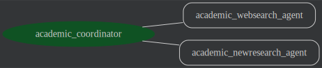

# Academic Research


## Overview

AI-driven agent designed to facilitate the exploration of the academic landscape surrounding seminal research works. Recognizing the challenge researchers face in navigating the expanding body of literature influenced by foundational studies, this agent offers a streamlined approach. By accepting a seminal paper identified provided as file input, the agent first analyzes the core contributions of the specified work.

1. It then leverages specialized Agent tools to identify and retrieve via Google Search recent academic publications that cite this seminal paper, mapping its contemporary influence.
2. Finally, synthesizing the analysis of the original paper with the findings from recent citing literature, and again utilizing specialized analytical tools, the agent proposes potential future research directions.

This capability aims to provide researchers with valuable insights into the ongoing impact of seminal research and to highlight promising avenues for novel investigation, thereby accelerating the research discovery process.

## Agent Details

The key features of the Academic Research include:

| Feature | Description |
| --- | --- |
| **Interaction Type** | Conversational |
| **Complexity**  | Easy |
| **Agent Type**  | Multi Agent |
| **Components**  | Tools: built-in Google Search |
| **Vertical**  | Education |


### Agent architecture:

This diagram shows the detailed architecture of the agents and tools used
to implement this workflow.


## Setup and Installation

1.  **Prerequisites**

    *   Python 3.11+
    *   Poetry
        *   For dependency management and packaging. Please follow the
            instructions on the official
            [Poetry website](https://python-poetry.org/docs/) for installation.

        ```bash
        pip install poetry
        ```

    * A project on Google Cloud Platform
    * Google Cloud CLI
        *   For installation, please follow the instruction on the official
            [Google Cloud website](https://cloud.google.com/sdk/docs/install).

2.  **Installation**

    ```bash
    # Clone this repository.
    git clone https://github.com/google/adk-samples.git
    cd adk-samples/python/agents/academic-research
    # Install the package and dependencies.
    # Note for Linux users: If you get an error related to `keyring` during the installation, you can disable it by running the following command:
    # poetry config keyring.enabled false
    # This is a one-time setup.
    poetry install
    ```

3.  **Configuration**

    *   Set up Google Cloud credentials.

        *   You may set the following environment variables in your shell, or in
            a `.env` file instead.

        ```bash
        export GOOGLE_GENAI_USE_VERTEXAI=true
        export GOOGLE_CLOUD_PROJECT=<your-project-id>
        export GOOGLE_CLOUD_LOCATION=<your-project-location>
        export GOOGLE_CLOUD_STORAGE_BUCKET=<your-storage-bucket>  # Only required for deployment on Agent Engine
        ```

    *   Authenticate your GCloud account.

        ```bash
        gcloud auth application-default login
        gcloud auth application-default set-quota-project $GOOGLE_CLOUD_PROJECT
        ```

## Running the Agent

**Using `adk`**

ADK provides convenient ways to bring up agents locally and interact with them.
You may talk to the agent using the CLI:

```bash
adk run academic_research
```

Or on a web interface:

```bash
 adk web
```

The command `adk web` will start a web server on your machine and print the URL.
You may open the URL, select "academic_research" in the top-left drop-down menu, and
a chatbot interface will appear on the right. The conversation is initially
blank. Here are some example requests you may ask the Academic Research to verify:

```
who are you
```

Sampled responses of these requrests are shown below in the [Example
Interaction](#example-interaction) section.

```
Hello! I am an AI Research Assistant.

My purpose is to help you explore the academic landscape related to a seminal paper you're interested in. I can:

Analyze a seminal paper you provide (Title/Authors, DOI, or URL).
Find recent academic papers that cite the seminal work using specialized tools.
Suggest potential future research directions based on the analysis and recent findings, again using specialized tools.
How can I help you today? Would you like to provide a seminal paper for analysis?
```

### Example Interaction

Below is an example interaction with the Academic Research. Note that the exact output
of the agent may be different every time. Not that the user provides a pdf with the seminal paper to analyze

```
 * user: who are you

Hello! I am an AI Research Assistant.

My purpose is to help you explore the academic landscape related to a seminal paper you're interested in. I can:

Analyze a seminal paper you provide (Title/Authors, DOI, or URL).
Find recent academic papers that cite the seminal work using specialized tools.
Suggest potential future research directions based on the analysis and recent findings, again using specialized tools.
How can I help you today? Would you like to provide a seminal paper for analysis?

 * user: 1706.03762v7.pdf
 * user: enclosed

Okay, I have received the paper "Attention Is All You Need". Thank you for providing it.

First, I will analyze the seminal paper to establish the context.

Seminal Paper Analysis

Seminal Paper: Attention Is All You Need, Vaswani et al., 2017 (Published at NIPS 2017)

Authors:

Ashish Vaswani (Google Brain)
Noam Shazeer (Google Brain)
Niki Parmar (Google Research)
Jakob Uszkoreit (Google Research)
Llion Jones (Google Research)
Aidan N. Gomez (University of Toronto / Google Brain)
Łukasz Kaiser (Google Brain)
Illia Polosukhin (Google Research)
Abstract: The dominant sequence transduction models are based on complex recurrent or convolutional neural networks that include an encoder and a decoder. The best performing models also connect the encoder and decoder through an attention mechanism. We propose a new simple network architecture, the Transformer, based solely on attention mechanisms, dispensing with recurrence and convolutions entirely. Experiments on two machine translation tasks show these models to be superior in quality while being more parallelizable and requiring significantly less time to train. Our model achieves 28.4 BLEU on the WMT 2014 English-to-German translation task, improving over the existing best results, including ensembles, by over 2 BLEU. On the WMT 2014 English-to-French translation task, our model establishes a new single-model state-of-the-art BLEU score of 41.8 after training for 3.5 days on eight GPUs, a small fraction of the training costs of the best models from the literature. We show that the Transformer generalizes well to other tasks by applying it successfully to English constituency parsing both with large and limited training data.

Summary: This paper introduces the Transformer, a novel neural network architecture designed for sequence transduction tasks, particularly machine translation. It marks a significant departure from previous state-of-the-art models which relied heavily on recurrent neural networks (RNNs) or convolutional neural networks (CNNs) within their encoder-decoder structures. The Transformer's core innovation is its complete reliance on attention mechanisms, specifically self-attention (or intra-attention), eliminating the need for sequential processing inherent in RNNs. This allows for significantly greater parallelization during training. The architecture features an encoder and decoder, each composed of stacks of layers containing multi-head self-attention mechanisms and position-wise feed-forward networks. The paper demonstrates that the Transformer achieves superior results on English-to-German and English-to-French translation benchmarks while requiring substantially less training time than previous models. It also shows the model's applicability to other tasks like English constituency parsing.

Key Topics/Keywords:

Transformer model
Attention Mechanism
Self-Attention / Intra-Attention
Multi-Head Attention
Sequence Transduction
Machine Translation
Encoder-Decoder Architecture
Parallelization
Positional Encoding
Natural Language Processing (NLP)
Key Innovations:

Proposed the Transformer architecture based entirely on attention mechanisms, removing recurrence and convolutions for sequence-to-sequence tasks.
Introduced Multi-Head Attention to allow the model to jointly attend to information from different representation subspaces at different positions.
Utilized Scaled Dot-Product Attention as an efficient attention mechanism.
Incorporated positional encodings to provide sequence order information without relying on recurrence.
Achieved state-of-the-art performance on machine translation with significantly improved training efficiency and parallelizability.
References Cited Within Seminal Paper:

Jimmy Lei Ba, Jamie Ryan Kiros, and Geoffrey E Hinton. Layer normalization. arXiv preprint arXiv:1607.06450, 2016.
Dzmitry Bahdanau, Kyunghyun Cho, and Yoshua Bengio. Neural machine translation by jointly learning to align and translate. CoRR, abs/1409.0473, 2014.
Denny Britz, Anna Goldie, Minh-Thang Luong, and Quoc V. Le. Massive exploration of neural machine translation architectures. CoRR, abs/1703.03906, 2017.
Jianpeng Cheng, Li Dong, and Mirella Lapata. Long short-term memory-networks for machine reading. arXiv preprint arXiv:1601.06733, 2016.
Kyunghyun Cho, Bart van Merrienboer, Caglar Gulcehre, Fethi Bougares, Holger Schwenk, and Yoshua Bengio. Learning phrase representations using rnn encoder-decoder for statistical machine translation. CoRR, abs/1406.1078, 2014.
Francois Chollet. Xception: Deep learning with depthwise separable convolutions. arXiv preprint arXiv:1610.02357, 2016.
Junyoung Chung, Çaglar Gülçehre, Kyunghyun Cho, and Yoshua Bengio. Empirical evaluation of gated recurrent neural networks on sequence modeling. CoRR, abs/1412.3555, 2014.
Chris Dyer, Adhiguna Kuncoro, Miguel Ballesteros, and Noah A. Smith. Recurrent neural network grammars. In Proc. of NAACL, 2016.
Jonas Gehring, Michael Auli, David Grangier, Denis Yarats, and Yann N. Dauphin. Convolutional sequence to sequence learning. arXiv preprint arXiv:1705.03122v2, 2017.
Alex Graves. Generating sequences with recurrent neural networks. arXiv preprint arXiv:1308.0850, 2013.
Kaiming He, Xiangyu Zhang, Shaoqing Ren, and Jian Sun. Deep residual learning for image recognition. In Proceedings of the IEEE Conference on Computer Vision and Pattern Recognition, pages 770–778, 2016.
Sepp Hochreiter, Yoshua Bengio, Paolo Frasconi, and Jürgen Schmidhuber. Gradient flow in recurrent nets: the difficulty of learning long-term dependencies, 2001.
Sepp Hochreiter and Jürgen Schmidhuber. Long short-term memory. Neural computation, 9(8):1735–1780, 1997.
Zhongqiang Huang and Mary Harper. Self-training PCFG grammars with latent annotations across languages. In Proceedings of the 2009 Conference on Empirical Methods in Natural Language Processing, pages 832–841. ACL, August 2009.
Rafal Jozefowicz, Oriol Vinyals, Mike Schuster, Noam Shazeer, and Yonghui Wu. Exploring the limits of language modeling. arXiv preprint arXiv:1602.02410, 2016.
Łukasz Kaiser and Samy Bengio. Can active memory replace attention? In Advances in Neural Information Processing Systems, (NIPS), 2016.
Łukasz Kaiser and Ilya Sutskever. Neural GPUs learn algorithms. In International Conference on Learning Representations (ICLR), 2016.
Nal Kalchbrenner, Lasse Espeholt, Karen Simonyan, Aaron van den Oord, Alex Graves, and Koray Kavukcuoglu. Neural machine translation in linear time. arXiv preprint arXiv:1610.10099v2, 2017.
Yoon Kim, Carl Denton, Luong Hoang, and Alexander M. Rush. Structured attention networks. In International Conference on Learning Representations, 2017.
Diederik Kingma and Jimmy Ba. Adam: A method for stochastic optimization. In ICLR, 2015.
Oleksii Kuchaiev and Boris Ginsburg. Factorization tricks for LSTM networks. arXiv preprint arXiv:1703.10722, 2017.
Zhouhan Lin, Minwei Feng, Cicero Nogueira dos Santos, Mo Yu, Bing Xiang, Bowen Zhou, and Yoshua Bengio. A structured self-attentive sentence embedding. arXiv preprint arXiv:1703.03130, 2017.
Minh-Thang Luong, Quoc V. Le, Ilya Sutskever, Oriol Vinyals, and Lukasz Kaiser. Multi-task sequence to sequence learning. arXiv preprint arXiv:1511.06114, 2015.
Minh-Thang Luong, Hieu Pham, and Christopher D Manning. Effective approaches to attention-based neural machine translation. arXiv preprint arXiv:1508.04025, 2015.
Mitchell P Marcus, Mary Ann Marcinkiewicz, and Beatrice Santorini. Building a large annotated corpus of english: The penn treebank. Computational linguistics, 19(2):313–330, 1993.
David McClosky, Eugene Charniak, and Mark Johnson. Effective self-training for parsing. In Proceedings of the Human Language Technology Conference of the NAACL, Main Conference, pages 152–159. ACL, June 2006.
Ankur Parikh, Oscar Täckström, Dipanjan Das, and Jakob Uszkoreit. A decomposable attention model. In Empirical Methods in Natural Language Processing, 2016.
Romain Paulus, Caiming Xiong, and Richard Socher. A deep reinforced model for abstractive summarization. arXiv preprint arXiv:1705.04304, 2017.
Slav Petrov, Leon Barrett, Romain Thibaux, and Dan Klein. Learning accurate, compact, and interpretable tree annotation. In Proceedings of the 21st International Conference on Computational Linguistics and 44th Annual Meeting of the ACL, pages 433–440. ACL, July 2006.
Ofir Press and Lior Wolf. Using the output embedding to improve language models. arXiv preprint arXiv:1608.05859, 2016.
Rico Sennrich, Barry Haddow, and Alexandra Birch. Neural machine translation of rare words with subword units. arXiv preprint arXiv:1508.07909, 2015.
Noam Shazeer, Azalia Mirhoseini, Krzysztof Maziarz, Andy Davis, Quoc Le, Geoffrey Hinton, and Jeff Dean. Outrageously large neural networks: The sparsely-gated mixture-of-experts layer. arXiv preprint arXiv:1701.06538, 2017.
Nitish Srivastava, Geoffrey E Hinton, Alex Krizhevsky, Ilya Sutskever, and Ruslan Salakhutdinov. Dropout: a simple way to prevent neural networks from overfitting. Journal of Machine Learning Research, 15(1):1929–1958, 2014.
Sainbayar Sukhbaatar, Arthur Szlam, Jason Weston, and Rob Fergus. End-to-end memory networks. In C. Cortes, N. D. Lawrence, D. D. Lee, M. Sugiyama, and R. Garnett, editors, Advances in Neural Information Processing Systems 28, pages 2440–2448. Curran Associates, Inc., 2015.
Ilya Sutskever, Oriol Vinyals, and Quoc VV Le. Sequence to sequence learning with neural networks. In Advances in Neural Information Processing Systems, pages 3104–3112, 2014.
Christian Szegedy, Vincent Vanhoucke, Sergey Ioffe, Jonathon Shlens, and Zbigniew Wojna. Rethinking the inception architecture for computer vision. CoRR, abs/1512.00567, 2015.
Vinyals & Kaiser, Koo, Petrov, Sutskever, and Hinton. Grammar as a foreign language. In Advances in Neural Information Processing Systems, 2015.
Yonghui Wu, Mike Schuster, Zhifeng Chen, Quoc V Le, Mohammad Norouzi, Wolfgang Macherey, Maxim Krikun, Yuan Cao, Qin Gao, Klaus Macherey, et al. Google's neural machine translation system: Bridging the gap between human and machine translation. arXiv preprint arXiv:1609.08144, 2016.
Jie Zhou, Ying Cao, Xuguang Wang, Peng Li, and Wei Xu. Deep recurrent models with fast-forward connections for neural machine translation. CoRR, abs/1606.04199, 2016.
Muhua Zhu, Yue Zhang, Wenliang Chen, Min Zhang, and Jingbo Zhu. Fast and accurate shift-reduce constituent parsing. In Proceedings of the 51st Annual Meeting of the ACL (Volume 1: Long Papers), pages 434–443. ACL, August 2013.
Now that I have analyzed the seminal paper, I will search for recent papers citing this work. I will look for papers published since January 2023 (covering roughly the last year and a bit).

* user: ok

Okay, here are the recent papers found citing "Attention Is All You Need" (Vaswani et al., 2017), published since January 2023, based on the tool's search:

Recent Papers Citing "Attention Is All You Need"

(Note: The list includes preprints and some non-peer-reviewed articles/blog posts identified by the search tool.)

2025 Publications/Preprints

Title: Tensor Product Attention Is All You Need
Author(s): Yifan Zhang, Mengxuan Fu, Ximing Xiang, Zhiyuan Zhang, Yuexiang Xie, Dongsheng Li, Dawei Yin
Publication Year: 2025 (v3 submitted April 9, 2025)
Source: arXiv
Link: https://arxiv.org/abs/2501.06425
Title: TransMLA: Multi-head Latent Attention Is All You Need
Author(s): Mengxuan Fu, Yifan Zhang, Zhiyuan Zhang, Xiaogang Chen, Dongsheng Li, Dawei Yin
Publication Year: 2025 (v1 submitted Feb 11, 2025)
Source: arXiv
Link: https://arxiv.org/abs/2502.06816 (Link inferred)
Title: Attention is All You Need Until You Need Retention
Author(s): M. Murat Yaslioglu
Publication Year: 2025 (v1 submitted Jan 15, 2025)
Source: arXiv
Link: https://arxiv.org/abs/2501.09166
Title: Transferable-guided Attention Is All You Need for Video Domain Adaptation
Author(s): André Sacilotti, Samuel Felipe dos Santos, Nicu Sebe, Jurandy Almeida
Publication Year: 2025 (Accepted to WACV'25)
Source: IEEE/CVF WACV'25 / arXiv
Link: https://arxiv.org/abs/2407.01375
Title: Moral Attention Is All You Need
Author(s): Mark Graves
Publication Year: 2025 (Published online Mar 17, 2025)
Source: Theology and Science
Link: https://doi.org/10.1080/14746700.2025.2472118
Title: "Attention", "Transformers", in Neural Network "Large Language Models" (Essay referencing recent work)
Author(s): Cosma Shalizi (referencing Farrell et al., 2025)
Publication Year: 2025 (Essay updated March/April 2025)
Source: Author's Website/Blog
Link: https://www.stat.cmu.edu/~cshalizi/notebooks/attention-is-all-you-need.html
2024 Publications/Preprints/Articles

Title: ATFF: Advanced Transformer with Multiscale Contextual Fusion for Medical Image Segmentation
Author(s): Xinping Guo, Lei Wang, Zizhen Huang, Yukun Zhang, Yaolong Han
Publication Year: 2024 (Published March 29, 2024)
Source: Journal of Computer and Communications, Vol.12 No.3
Link: https://www.scirp.org/reference/referencespapers?referenceid=3338278 (Citation page)
Title: Multimodal Attention is all you need
Author(s): Marco Saioni, Cristina Giannone
Publication Year: 2024 (CEUR Workshop Proceedings, paper dated Dec 4, 2024)
Source: CEUR Workshop Proceedings (Evalita 2023)
Link: https://ceur-ws.org/Vol-3616/paper34.pdf (Link inferred)
Title: Attention is all you need: utilizing attention in AI-enabled drug discovery
Author(s): Yang Zhang, Caiqi Liu, Mujiexin Liu, Tianyuan Liu, Hao Lin, Cheng-Bing Huang, Lin Ning
Publication Year: 2024 (Published Jan 6, 2024)
Source: Briefings in Bioinformatics, Volume 25, Issue 1
Link: https://doi.org/10.1093/bib/bbad467
Title: HIERARCHICAL ENCODING AND CONDITIONAL ATTENTION IN NEURAL MACHINE TRANSLATION
Publication Year: 2024 (Published September 2024)
Source: The American Journal of Engineering and Technology, 6(09)
Link: https://doi.org/10.37547/tajet/Volume06Issue09-07
Title: Measurements With A Quantum Vision Transformer: A Naive Approach
Publication Year: 2024 (Proceedings published 2024)
Source: EPJ Web of Conferences, Volume 295 (ICHEP 2022)
Link: https://www.epj-conferences.org/articles/epjconf/ref/2024/01/epjconf_ichep2022_12003/epjconf_ichep2022_12003.html
Title: Attention is all you need: discovering the Transformer paper (Article/Blog Post)
Author(s): Luis Serrano
Publication Year: 2024
Source: Towards Data Science
Link: https://towardsdatascience.com/attention-is-all-you-need-discovering-the-transformer-paper-731ad0737c6d
Title: Paper Walkthrough: Attention Is All You Need (Article/Blog Post)
Author(s): Muhammad Ardi
Publication Year: 2024 (Published Nov 3, 2024)
Source: Towards Data Science
Link: https://towardsdatascience.com/paper-walkthrough-attention-is-all-you-need-69388903b711
Title: Attention is all you need – Transformers (Article/Blog Post)
Author(s): Strahinja Zivkovic
Publication Year: 2024 (Published Nov 28, 2024)
Source: Master Data Science (Blog)
Link: https://masterdatascience.com/attention-is-all-you-need-transformers/
Title: The Groundbreaking Transformer Paper: “Attention is All You Need” (Article/Blog Post)
Author(s): Brian Carter
Publication Year: 2024 (Published Oct 5, 2024)
Source: The Brian Carter Group (Blog)
Link: https://briancartergroup.com/the-groundbreaking-transformer-paper-attention-is-all-you-need/
Now, based on the seminal paper "Attention Is All You Need" and these recent citing works, I will use a specialized tool to suggest potential future research directions.

* user: ok

Okay, here are the potential future research directions suggested by the tool, based on the seminal "Attention Is All You Need" paper and the recent citing works:

Potential Future Research Directions

Beyond Dot-Product Attention: Exploring Non-Linear and Learnable Similarity Metrics: Instead of just scaled dot-product, research different, perhaps non-linear or fully learned, ways to measure similarity within the attention mechanism. This could capture more complex relationships and lead to more robust or efficient models.
Intrinsically Graph-Aware Attention Mechanisms: Develop attention mechanisms that naturally understand and operate on graph structures (like molecules or social networks) without needing to force them into sequences first.
Physics-Informed and Constraint-Driven Attention: Design attention mechanisms that incorporate known physical laws, rules, or constraints directly into their structure. This could lead to more accurate and efficient models for scientific discovery and simulation.
Hybrid Neuro-Symbolic Attention Architectures: Create attention mechanisms that can interact with symbolic knowledge bases or reasoning engines, combining the strengths of deep learning and traditional AI for better reasoning and fact-checking.
Dynamic Sparsity and Adaptive Computation in Attention: Explore attention mechanisms that dynamically adjust which elements attend to each other based on context (sparse attention) or adapt the amount of computation used per element or layer, making Transformers more efficient for very long sequences or limited resources.
Biologically Plausible Attention and Memory Integration: Investigate attention architectures inspired by how biological brains handle attention and memory, potentially leading to novel models with different capabilities.
Meta-Attention for Interpretability and Controllability: Develop attention mechanisms that can observe their own attention patterns ("meta-attention"). This could improve our understanding of why the model makes certain decisions and potentially allow for more control over its focus.
Attention Mechanisms for Fundamentally Non-Sequential Data Structures: Design attention mechanisms specifically for data that doesn't have a natural order, such as sets of items or point clouds, without imposing artificial sequences.
Temporally Continuous Attention for Streaming Data: Create attention mechanisms suited for continuous, real-time data streams where the idea of a fixed sequence length doesn't apply, crucial for real-time monitoring or control.
Cross-Modal Associative Attention Kernels: Develop new attention "kernels" that can directly compute similarity between elements from different modalities (e.g., image regions and text concepts) without needing to project them into a common space first, enabling tighter multimodal integration.
This analysis provides a starting point for exploring the evolution of Transformer architectures and attention mechanisms.

Would you like to dive deeper into any of these specific research directions, or perhaps explore another seminal paper?

```

## Running Tests

For running tests and evaluation, install the extra dependencies:

```bash
poetry install --with dev
```

Then the tests and evaluation can be run from the `academic-research` directory using
the `pytest` module:

```bash
python3 -m pytest tests
python3 -m pytest eval
```

`tests` runs the agent on a sample request, and makes sure that every component
is functional. `eval` is a demonstration of how to evaluate the agent, using the
`AgentEvaluator` in ADK. It sends a couple requests to the agent and expects
that the agent's responses match a pre-defined response reasonablly well.


## Deployment

The Academic Co-Research can be deployed to Vertex AI Agent Engine using the following
commands:

```bash
poetry install --with deployment
python3 deployment/deploy.py --create
```

When the deployment finishes, it will print a line like this:

```
Created remote agent: projects/<PROJECT_NUMBER>/locations/<PROJECT_LOCATION>/reasoningEngines/<AGENT_ENGINE_ID>
```

If you forgot the AGENT_ENGINE_ID, you can list existing agents using:

```bash
python3 deployment/deploy.py --list
```

The output will be like:

```
All remote agents:

123456789 ("academic_research")
- Create time: 2025-05-10 09:33:46.188760+00:00
- Update time: 2025-05-10 09:34:32.763434+00:00

```

You may interact with the deployed agent using the `test_deployment.py` script
```bash
$ export USER_ID=<any string>
$ python3 deployment/test_deployment.py --resource_id=${AGENT_ENGINE_ID} --user_id=${USER_ID}
Found agent with resource ID: ...
Created session for user ID: ...
Type 'quit' to exit.
Input: Hello. What can you do for me?
Response: Hello! I'm an AI Research Assistant. I can help you analyze a seminal academic paper.

To get started, please provide the seminal paper you wish to analyze as a PDF.
```

To delete the deployed agent, you may run the following command:

```bash
python3 deployment/deploy.py --delete --resource_id=${AGENT_ENGINE_ID}
```

## Customization

The Academic Research can be customized to better suit your requirements. For example:

 1. Integrate Specialized Search Tools: Augment the agent's discovery capabilities by incorporating additional academic search functionalities, such as an ArXiv-specific search tool, to complement or replace the default search mechanism, allowing for more targeted retrieval from specialized databases and preprint archives.
 2. Implement Output Visualization: Enhance the presentation of research findings by adding modules to visualize the network of cited papers or to graphically represent suggested future research topics, thereby offering a more intuitive and interconnected understanding of the academic landscape.
3. Customize Agent Instructions: Modify the prompts guiding the academic_websearch and academic_newresearch sub-agents. This allows you to direct their analytical focus (e.g., by specifying the depth of citation analysis, emphasizing interdisciplinary connections for future research, or ensuring adherence to particular academic writing conventions) or to refine the structure and detail of their outputs.
4. Download the seminal paper via DOI or URL:  Augment the agent's capabilities by enabling direct download of seminal papers. This feature would allow the agent to:
* Resolve DOI to PDF: Given a Digital Object Identifier (DOI), the agent could leverage APIs or web scraping techniques to locate and download the corresponding PDF of the paper. This streamlines the process of accessing primary sources, especially when the DOI is already known.
* Download from URL: If a direct URL to the paper's PDF or an academic repository page is provided, the agent could be configured to navigate to that URL and initiate the download. This would be particularly useful for papers available on institutional repositories, personal academic websites, or preprint servers that might not have a readily resolvable DOI.
* Integration with Reference Managers: The downloaded papers could then be automatically imported into a specified reference manager (e.g., Zotero, Mendeley, EndNote), along with their metadata, facilitating seamless organization and citation management for the user's research library. This integration would significantly enhance the efficiency of literature review and research compilation.
